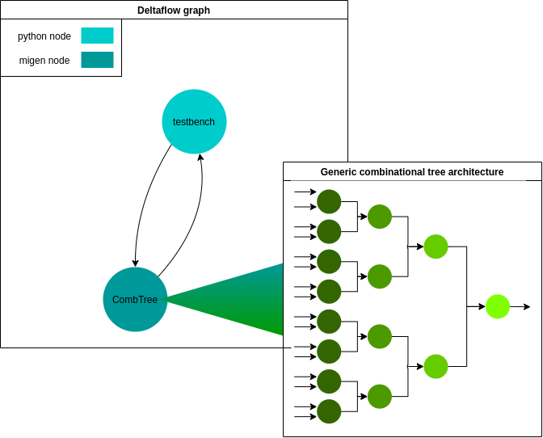

# Combinational tree example

### Description

This small two-node deltaflow graph is composed of one migen node (the combinational tree, DUT) and one python interactive node providing the inputs and checking the outputs. (the testbench). Its purpose is to perform a number of encoded operations (min, max, sum, mean) on a vector of input data and output the result. The design is based on the duplication of a 2-input/1-output core-unit to form a combinational tree of variable size and variable bit-width. The graph is pictured below:

#### The DUT

The DUT is a migen node with the following I/Os:
 
 - generics:
    - N_BITS: the bit-width of each input
    - N_INPUTS: the number of inputs
 - inputs:
    - d_in: the input data vector
    - cmd: the operation to perform
 - outputs:
    - d_out: the result (integer)
    - err: error signal

It generates the tree corresponding according to the values of the specified generics, making the node flexible and re-usable for other systems where the desired number of bits and/or number of inputs would be different.

### How to run

The comb_tree folder is organised as follows:
 - Readme.md: documentation
 - core_unit.py: migen module used in the DUT
 - comb_tree.py: contains the DUT, the testbench and the main function for the routing of the graph
 - commands.py: the list of commands
 - deltaflowGraph.png: drawing of the deltaflow graph
 - baseUnit.png: schematic of the core unit#

 To run the example, just run the comb_tree.py file. Tweak the generic parameters and look at the generated vcd file to see the changes in the tree

### The core unit

This is a small fully combinational unit with 2 data inputs and 1 output, a command and an error signal. The error signal is set to 1 if the received command is not supported.
Otherwise, the encoded operation is applied to the 2 inputs and the result is wired to the output. The unit is schematised below:

### Comments on generics

The generics can be tuned to any integer value, with the following considerations to keep in mind:
 - Migen Array is not supported yet, so N_BITS x N_INPUTS <= 64
 - Changing N_INPUTS to a non-power-of-two value could result in wrong mean() calculations, min() value if inputs are strictly positive and max() values if inputs are strictly negative. This is because of dummy units that are added to reduce the tree to 1 unique output which are filled with 0's.

