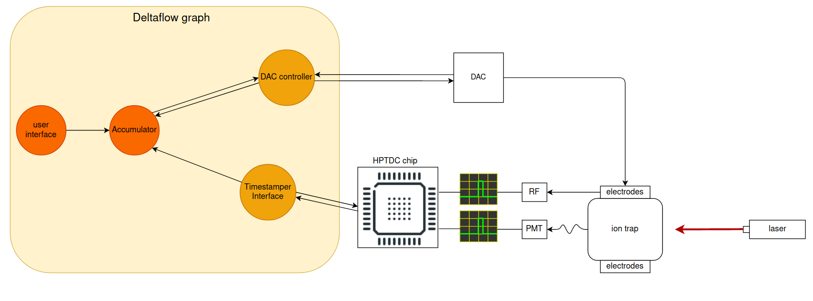
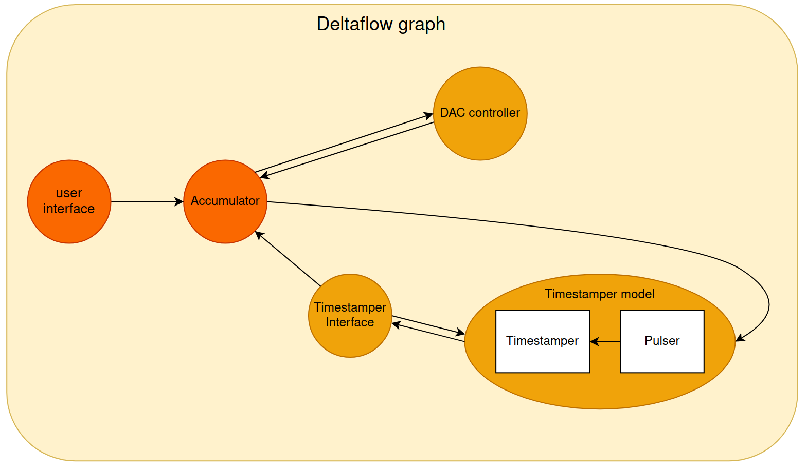
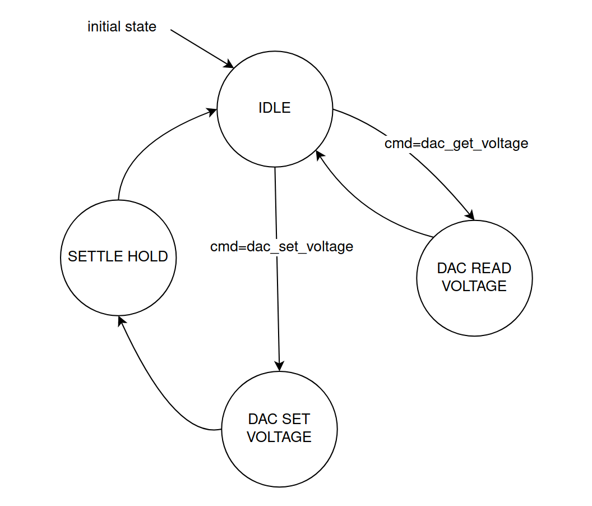
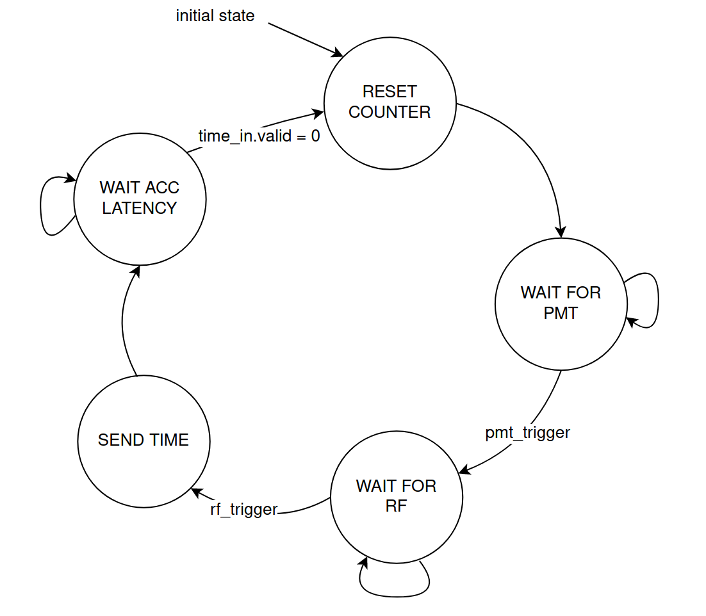
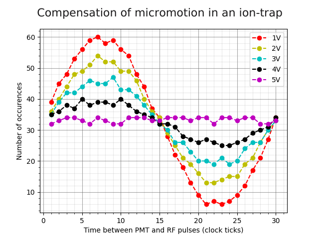

# Micromotion Demo documentation
### Description

The Micromotion Demo is a small deltaflow program simulating a part of an ion-trap control system. Inside an ion-trap, a combination of RF and DC voltages generates an electric potential used to trap the ion. The ion is laser cooled so that it oscillates around the minimum of the electric potential. However, when uncontrolled static voltages collect on nearby surfaces, this pushes the ion out of the minimum. The result is more significant oscillations and is known as excess micromotion. 

Control systems must compensate for stray static voltages to minimise micromotion before any qubit operations can take place. 

This example creates a control loop to measure ion micromotion and provide a feedback voltage to the trap electrodes. 

Further reading:
www.nist.gov/publications/minimization-ion-micromotion-paul-trap

#### How the measurement works

The ion micromotion is measured by collecting the time intervals between two pulsed signals triggered by the experiment. One is called the PMT trigger, generated upon the ion emitting a photon and the other is called RF trigger, generated upon a zero-crossing of the RF signal. The time between the two pulses is linked because the probability distribution of photon absorption (and subsequent emission) is dependent on the magnitude of the ion oscillation.

When there is significant micromotion, we expect a histogram of measured times to plot a sine wave. Once well compensated, the histogram will show a near-uniform distribution for the relative time between PMT and RF triggers.

### Contents and How to run

Micromotion folder content:
 - migen
   - DAC_controller.py
   - timestamper_model.py
   - timestamper_interface.py
   - accumulator.py
   - user_interface.py
   - run_experiment.py
 - python
   - micromotion_graph.py
 - images
 - Readme.md

The contents of the `python` folder is pure python-deltaflow implementation, whereas `migen` contains a more complex hybrid python-migen implementation.

To run the experiment:
   - change `LENGTH_EXPERIMENT` (the number of points) in `accumulator.py` to any preferred value
   - type: `python examples/demos/micromotion/migen/run_experiment.py` in a bash terminal from the root of the Deltalanguage folder
   - to start the simulation, type `y` and `Enter`

### Architecture

The real world system architecture would look like this:

In this system, a deltaflow graph interfaces with the ion-trap experiment hardware and a high performance timestamper chip. High timing constraints on the pulse detection of PMT and RF triggers motivates the use of a high performance chip for the measurement readout over an FPGA block which would be too slow. Information on this chip can be found here: https://cds.cern.ch/record/1067476/files/cer-002723234.pdf

For simulation purposes the above architecture has been fully implemented as a deltaflow graph:

The graph contains two python nodes (dark orange) and three migen nodes (light orange). The DAC controller and timestamper chip interface are targetted for an FPGA integration whereas the timestamper model and the pulser aim at simulating the measurement system. The feedback connection from the accumulator to the pulser reflects the action of a DAC on the ion-trap's electrodes.

#### User interface

The user interface is a simple python node triggering the start of the experiment.

#### Accumulator

The accumulator receives the measurement results of the time between RF and PMT pulses from the timestamper interface node and builds a histogram with the data. Based on the statistical distribution, it calculates a new voltage compensation step and sends the new voltage to the DAC controller. For simulation purposes, the accumulator generates new photon arrival times to fit a certain distribution. (This part would be removed for a real implementation). The accumulator then just loops over a number of compensation steps and collects the data. Since timing constraints are not critical on this node, it was implemented in python and targets embedding into a CPU.

#### DAC controller

The DAC controller is a migen node handling the communication with a DAC (digital to analog converter). Its main functionalities are:
Reading the DAC's voltage register and sending it to the accumulator.
Setting the DAC's voltage register according to the value provided by the accumulator.
Sending the controller's status to the accumulator.

An FSM is used to provide these functionalities:

#### Timestamper model

This migen node is used for simulation purposes only. It contains two migen modules:
A pulser to provide the trigger signals to the chip model.
A model for the HPTDC chip that performs the timestamping.

##### Pulser

This module increments a counter and fires an RF trigger whenever the counter reaches maximum value, and a PMT trigger based on photon time input (provided by the accumulator). The reason this is not a separate node from the timestamper module is to keep synchronisation between the two which is not possible using 2 separate nodes as inter-node communication is asynchronous.

##### Timestamper

This module has a generic number of parallel trigger inputs (say 32 as in CERN's chip) and is clocked by the pulser to have the same time reference. It has a pulse detector which removes potential metastability issues arising from asynchronous trigger signals and detects pulses on every input. When a pulse is detected it stores the value of a counter which serves as a time reference into hit registers. The hit registers values are multiplexed and redirected to the output to be read out by the interface node.

#### Timestamper interface

This node handles the interfacing to the timestamper chip. It computes relative time spans between PMT and RF triggers and waits for the accumulator to poll its output register. An FSM is used for the control

### Some results

As the measurements reflect a statistical behaviour, a minimal number of samples (~1000 per compensation step) is necessary to get meaningful results out of the histograms. To produce the following results the total simulation time was around 40 minutes. 
In this example a five-step compensation was applied with a target voltage of 5V and initial value at 1V with a tuning of +/- 1V per step and 1000 samples per step (arbitrary selection of the tuning step as well as the initial and target voltages). At the end of the simulation, the curve is close to flat which means the system reached compensation.

   - x-axis --> time values between PMT and RF triggers (1-30 range shifted for every new voltage compensation step)
   - y-axis --> number of occurence of given x time value

